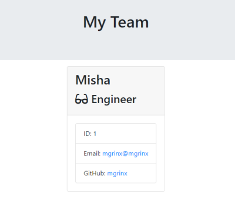

# Team Roster Generator

An application in Node.js that generates a clean HTML team roster.

## Features

- Supports any team size
- Employee types: manager, engineer, intern

## Usage

1. Clone the repository
2. Run `npm install` in the repository root
3. Run `node app.js`
4. Answer questions about team members
5. Once done, HTML will be saved to the output folder